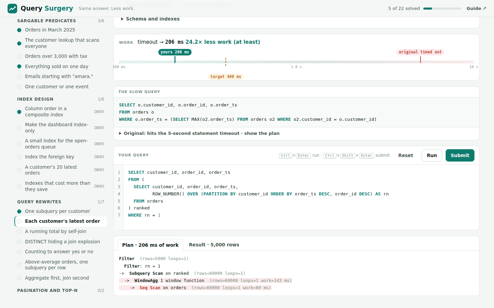

# Query Surgery

**Advanced SQL optimization, hands-on: rewrite slow queries and design indexes against an instrumented engine with B-tree indexes, `EXPLAIN ANALYZE` and a work meter, in your browser.**

[](https://aboualyxcode.github.io/query-surgery/)
[](https://github.com/aboualyXcode/query-surgery/actions/workflows/test.yml)


Every challenge is a slow query or workload from Stagedoor, a fictional ticketing company, running against 60,000 orders, 5,000 customers and 120,000 activity rows. Your rewrite must return **exactly the same result** with a fraction of the work, or your indexes must bring a workload under budget. A log-scale work meter shows the original, the target and yours; `EXPLAIN ANALYZE` shows why.

**[▶ Open the playground](https://aboualyxcode.github.io/query-surgery/)**



## Contents

- [What you'll practise](#what-youll-practise)
- [Quick start](#quick-start)
- [How grading works](#how-grading-works)
- [The engine](#the-engine)
- [The guide](#the-guide)
- [Repository structure](#repository-structure)
- [Testing](#testing)
- [Contributing a challenge](#contributing-a-challenge)
- [Credits](#credits)

## What you'll practise

The techniques are engine-agnostic: they work on PostgreSQL, MySQL, SQL Server, Oracle, SQLite and the warehouses, because they fix what optimizers cannot fix for you.

| Track | Challenges |
|---|---|
| **Sargable predicates** (6) | Functions on indexed columns, implicit type conversion, arithmetic on columns, `CAST(ts AS DATE)`, `lower()` on normalized data, OR across columns into `UNION ALL` |
| **Index design** (6) | Composite column order, covering indexes and index-only scans, partial indexes, foreign-key indexes, order-providing indexes for top-N, dropping indexes that cost more than they save |
| **Query rewrites** (7) | N+1 correlated subqueries, latest row per group, running totals by self-join, DISTINCT hiding join fan-out, COUNT for existence, per-row repeated aggregates, aggregating before joining |
| **Pagination and top-N** (2) | Deep OFFSET into keyset pagination, top-N per group |
| **Capstone** (1) | Non-sargable dates, three correlated subqueries and a DISTINCT, in one report |

## Quick start

**In the browser:** open [aboualyxcode.github.io/query-surgery](https://aboualyxcode.github.io/query-surgery/). No install, no account; progress is saved in your browser. Queries run in a Web Worker, so even a query that hits the timeout never freezes the page.

**Locally:**

```sh
git clone https://github.com/aboualyXcode/query-surgery.git
cd query-surgery
python3 -m http.server 8000      # then open http://localhost:8000
```

Opening `index.html` directly also works; browsers block Web Workers on `file://`, so queries then run on the page's thread.

## How grading works

- **Rewrite challenges.** Your query must return the same rows as the slow query (as a multiset, or in order when the task says so), and do at most the target amount of work. Only queries are allowed: changing the schema is not an optimization of the query.
- **Index challenges.** The queries are fixed and you write `CREATE INDEX` / `DROP INDEX`. The workload's work per hour, weighted by how often each query runs, plus the cost of maintaining your indexes on inserts, must fit the target, within budgets on index count and size.
- **Feedback.** `EXPLAIN ANALYZE` plans show rows, loops, index entries read versus rows returned, work per operator, and a note whenever a predicate cannot use an index, with the reason.

## The engine

The playground extends the SQL engine from [SELECT * FROM production](https://github.com/aboualyXcode/select-from-production) with:

- **B-tree indexes:** composite, covering (`INCLUDE`), partial (`WHERE`) and unique.
- **A cost-based planner** that does what nearly every engine does:
  - index range, index-only and ordered index scans, chosen by exact cost;
  - sargability analysis;
  - predicate pushdown below joins, respecting outer-join semantics;
  - hash joins and index nested loops chosen at run time;
  - hashed semi-joins for `EXISTS`;
  - early termination for `LIMIT` and `EXISTS`.
- **`EXPLAIN [ANALYZE]`** with PostgreSQL-style output.
- **A work meter:** 1 unit ≈ 1 µs on a single node, with a 5-second statement timeout.

It deliberately does not reorder joins or push predicates into derived tables, and no challenge depends on those. [Chapter 6](docs/06-how-the-engine-works.md) documents the planner, the cost model and their limits.

## The guide

1. [Reading query plans](docs/01-reading-plans.md): getting real plans on each engine, and what to look for
2. [Sargable predicates](docs/02-sargable-predicates.md): conditions an index can use, and how to rewrite the ones it cannot
3. [Index design](docs/03-index-design.md): column order, covering, order, partial and foreign-key indexes, and their costs
4. [Query rewrites](docs/04-query-rewrites.md): N+1 subqueries, window functions, semi-joins, eager aggregation
5. [Pagination and top-N](docs/05-pagination-and-top-n.md): keyset pagination and top-N per group
6. [How the lab's engine works](docs/06-how-the-engine-works.md): planner rules, cost model, limitations, verification

## Repository structure

```
index.html, css/, js/ui.js          the playground
js/worker.js, js/runner.js          runs queries off the main thread (with a same-thread fallback)
js/sql/parser.js                    SQL parser, including CREATE INDEX and EXPLAIN ANALYZE
js/sql/functions.js                 types and ~150 functions
js/sql/engine.js                    executor, indexes, planner, cost meter, EXPLAIN
js/data.js                          the deterministic Stagedoor dataset (~300,000 rows)
js/challenges.js                    the 22 challenges and the grader
docs/                               the guide
tests/                              SQLite differential, engine, planner and challenge tests
```

## Testing

```sh
python3 tests/differential_sqlite.py   # 101 queries match SQLite, each run with and without 14 indexes
node tests/engine.test.js              # 104 checks of SQL semantics
node tests/planner.test.js             # the planner's choices the challenges rely on
node tests/challenges.test.js          # every challenge: slow misses, solutions match and pass, cheats fail
```

GitHub Actions runs all four on every push.

## Contributing a challenge

Challenges are plain objects in `js/challenges.js`:

```js
{
  id: 'my-challenge', track: 'rewrites', level: 2, target: 200000,   // work units
  title: 'Short title', scenario: 'Who is waiting, and why.',
  setup: 'CREATE INDEX …',                 // optional: the starting schema
  slow: `SELECT …`,                        // the query to fix
  solution: `SELECT …`, alt: `SELECT …`,   // must return exactly the slow query's result
  hints: ['…'], explain: 'Why it works, on every engine.',
}
```

Index challenges use `mode: 'index'`, a `workload` of `{ sql, perHour }`, optional `writes` and `budget`, and `traps` (wrong designs that must fail). Run `node tests/challenges.test.js my-challenge`: it fails if the slow query already meets the target, or if a solution changes the result or misses it.

## Credits

Created by [Mahmoud Aboualy](https://github.com/aboualyXcode). Part of a series with [Desired State](https://github.com/aboualyXcode/k8s-desired-state), [Blast Radius](https://github.com/aboualyXcode/k8s-blast-radius), [Lakehouse Modeling Lab](https://github.com/aboualyXcode/lakehouse-modeling-lab), [SELECT * FROM production](https://github.com/aboualyXcode/select-from-production) and [Shuffle, Stream & Grant](https://github.com/aboualyXcode/shuffle-stream-grant).

Typefaces: Albert Sans and Red Hat Mono from Google Fonts. Stagedoor is fictional.
